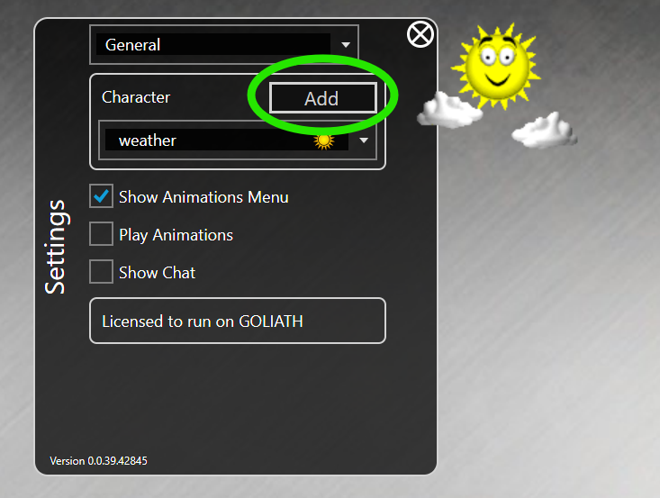
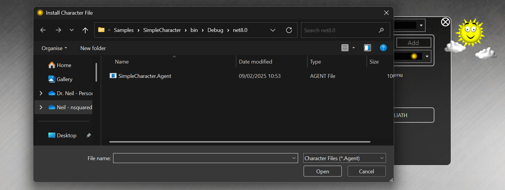
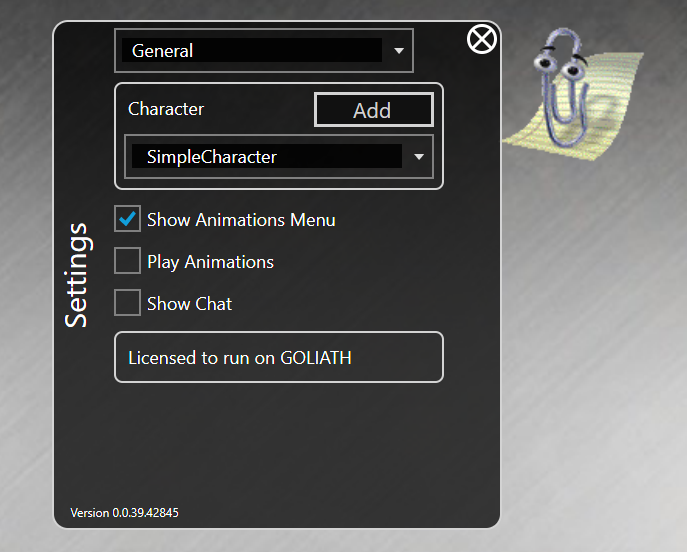

# Building a Simple Character

To build a character for nsquared agents, create a .NET 10 class library with a class that
implements the [`IAgent`](IAgent.md) interface. Install the current .NET 10 SDK and use the
latest stable `nsquared.agents.api` NuGet package.

You will also need to have some images for the animated frames of the character. In this example we are using a small set of images to create a simple clippy character.  These frames can be found in the [sample **Frames** folder](https://github.com/nsquaredsolutions/agents/tree/main/Samples/SimpleCharacter/Assets/Frames).

> [The full source code for this example](https://github.com/nsquaredsolutions/agents/tree/main/Samples/SimpleCharacter)

## Step-by-Step creating a simple nsquared agent character

1. Start by creating a new C# class library project named SimpleCharacter.

   ```bash
    dotnet new classlib --name SimpleCharacter
   ```

   This will create a new folder named SimpleCharacter containing C# project named SimpleCharacter, and a code file named Class1.cs.

1. Rename the file `Class1.cs` to `Character.cs`
1. Rename the class in the code to `Character`

   ```cs
    namespace SimpleCharacter;
    public class Character
    {

    }
   ```

1. In the `SimpleCharacter.csproj` file set the target framework and plugin file extension:

   ```xml
    <TargetFramework>net10.0</TargetFramework>
    <TargetExt>.Agent</TargetExt>
   ```

1. Add the API and Avalonia packages:

   ```sh
   dotnet add package nsquared.agents.api
   dotnet add package Avalonia
   ```

   `dotnet add package` selects the latest stable package unless a version is specified.

1. In the SimpleCharacter folder create a new folder named `Assets`.
1. In the new `Assets` folder create a folder named `Frames`.
1. In the `Frames` folder copy the frame images from the [sample **Frames** folder](https://github.com/nsquaredsolutions/agents/tree/main/Samples/SimpleCharacter/Assets/Frames).
1. In the `Assets` folder create a file named `Actions.json`. Define the animation actions and
   states in this file. See the [Actions.json schema](ActionsSchema.md) for the field reference.
1. Edit the `Actions.json` file and put the following json to define two actions and two states.
  
   ```json
   {
        "ActionItems": [
            {
                "Name": "Show",
                "Return": null,
                "Frames": [
                    {
                        "SoundEffect": null,
                        "Duration": 10,
                        "ExitBranch": -1,
                        "Images": [
                            {
                                "Filename": "0000",
                                "OffsetX": 0,
                                "OffsetY": 0
                            }
                        ],
                        "Mouths": [],
                        "Branches": []
                    }
                ],
                "Reverse": false,
                "ActionMenuSelected": null
            },
            {
                "Name": "Idle",
                "Return": null,
                "Frames": [
                    {
                        "SoundEffect": null,
                        "Duration": 10,
                        "ExitBranch": -1,
                        "Images": [
                            {
                                "Filename": "0000",
                                "OffsetX": 0,
                                "OffsetY": 0
                            }
                        ],
                        "Mouths": [],
                        "Branches": []
                    },
                    {
                        "SoundEffect": null,
                        "Duration": 10,
                        "ExitBranch": -1,
                        "Images": [
                            {
                                "Filename": "0045",
                                "OffsetX": 0,
                                "OffsetY": 0
                            }
                        ],
                        "Mouths": [],
                        "Branches": []
                    },
                    {
                        "SoundEffect": null,
                        "Duration": 10,
                        "ExitBranch": -1,
                        "Images": [
                            {
                                "Filename": "0046",
                                "OffsetX": 0,
                                "OffsetY": 0
                            }
                        ],
                        "Mouths": [],
                        "Branches": []
                    },
                    {
                        "SoundEffect": null,
                        "Duration": 10,
                        "ExitBranch": 9,
                        "Images": [
                            {
                                "Filename": "0047",
                                "OffsetX": 0,
                                "OffsetY": 0
                            }
                        ],
                        "Mouths": [],
                        "Branches": []
                    },
                    {
                        "SoundEffect": null,
                        "Duration": 10,
                        "ExitBranch": 9,
                        "Images": [
                            {
                                "Filename": "0048",
                                "OffsetX": 0,
                                "OffsetY": 0
                            }
                        ],
                        "Mouths": [],
                        "Branches": []
                    },
                    {
                        "SoundEffect": null,
                        "Duration": 10,
                        "ExitBranch": -1,
                        "Images": [
                            {
                                "Filename": "0049",
                                "OffsetX": 0,
                                "OffsetY": 0
                            }
                        ],
                        "Mouths": [],
                        "Branches": [
                            {
                                "BranchTo": 8,
                                "Probability": 3
                            }
                        ]
                    },
                    {
                        "SoundEffect": null,
                        "Duration": 15,
                        "ExitBranch": 8,
                        "Images": [
                            {
                                "Filename": "0050",
                                "OffsetX": 0,
                                "OffsetY": 0
                            }
                        ],
                        "Mouths": [],
                        "Branches": [
                            {
                                "BranchTo": 7,
                                "Probability": 98
                            },
                            {
                                "BranchTo": 6,
                                "Probability": 2
                            }
                        ]
                    },
                    {
                        "SoundEffect": null,
                        "Duration": 10,
                        "ExitBranch": 9,
                        "Images": [
                            {
                                "Filename": "0051",
                                "OffsetX": 0,
                                "OffsetY": 0
                            }
                        ],
                        "Mouths": [],
                        "Branches": []
                    },
                    {
                        "SoundEffect": null,
                        "Duration": 10,
                        "ExitBranch": -1,
                        "Images": [
                            {
                                "Filename": "0052",
                                "OffsetX": 0,
                                "OffsetY": 0
                            }
                        ],
                        "Mouths": [],
                        "Branches": []
                    },
                    {
                        "SoundEffect": null,
                        "Duration": 10,
                        "ExitBranch": -1,
                        "Images": [
                            {
                                "Filename": "0053",
                                "OffsetX": 0,
                                "OffsetY": 0
                            }
                        ],
                        "Mouths": [],
                        "Branches": []
                    },
                    {
                        "SoundEffect": null,
                        "Duration": 10,
                        "ExitBranch": -1,
                        "Images": [
                            {
                                "Filename": "0000",
                                "OffsetX": 0,
                                "OffsetY": 0
                            }
                        ],
                        "Mouths": [],
                        "Branches": []
                    }
                ],
                "Reverse": false,
                "ActionMenuSelected": null
            }
        ],
        "States": {
            "Showing": [
                "Show"
            ],
            "IdlingLevel1": [
                "Idle"
            ]
        }
    }
   ```

    [More information on the schema for the `Actions.json` file.](ActionsSchema.md)

1. Include assets using the resource type expected by `IAgent`. Create `Assets\Audio` and add
   `Assets\Icon.ico` if using the paths shown below:

   ```xml
    <ItemGroup>
        <AvaloniaResource Include="Assets\**" />
        <AvaloniaResource Remove="Assets\Audio\**" />
        <None Remove="Assets\Frames\**" />
        <EmbeddedResource Include="Assets\Audio\**" />
    </ItemGroup>
   ```

1. Edit `Character.cs` to implement [`IAgent`](IAgent.md). `WakeWord`, `Personality`, and `Voice`
   are optional; override them to customize voice activation and AI responses for the character.

    ```cs
    using nsquared.agents;

    namespace SimpleCharacter;

    public class Character : IAgent
    {
        public string Name { get; set; } = "SimpleCharacter";
        public string AssemblyName { get; set; } = "SimpleCharacter";
        public Uri ActionsFileUri => new($"avares://{AssemblyName}/Assets/Actions.json");
        public string AudioFilesPath => $"{Name}.Assets.Audio.";
        public string FrameAssetPath => $"avares://{AssemblyName}/Assets/Frames/";
        public string IconPath => $"avares://{AssemblyName}/Assets/Icon.ico";
        public string WakeWord => "SimpleCharacter";
        public string? Personality => "You are a friendly, concise desktop assistant.";
        public string? Voice => null;
    }
    ```

1. Build the SimpleCharacter project. It should build the `SimpleCharacter.Agent` file in a bin folder.

1. Run the nsquared agents application and open Settings, and then go to the `Add` button next to the character list

    

1. This will open a file dialog. Find the `SimpleCharacter.Agent` file you built.

    

1. The new SimpleCharacter will be selected

    

> [The full source code for this example](https://github.com/nsquaredsolutions/agents/tree/main/Samples/SimpleCharacter)
