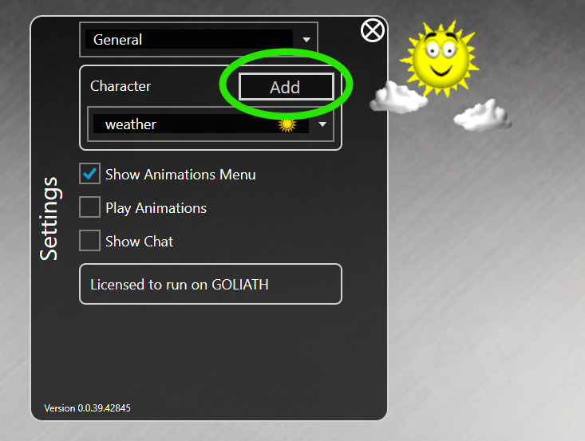

# Building a Simple Character

In order to build a new character for nsquared agents you will need to build a .NET 8.0 assembly that contains a class that implements the [`IAgent`](IAgent.md) interface.

You will also need to have some images for the animated frames of the character. In this example we are using a small set of images to create a simple clippy character.  These frames can be found in the [sample `Frames` folder](../../Samples/SimpleCharacter/Assets/Frames/).

[The full source code for this example](../../Samples/SimpleCharacter/)

## Step-by-Step creating a simple nsquared agent character

1. Start by creating a new C# class library project named SimpleCharacter.

   ```bash
    dotnet new classlib --name SimpleCharacter
   ```

   This will create a new folder named SimpleCharacter containing C# project named SimpleCharacter, and a code file named Class1.cs.

1. Rename the file `Class1.cs` to `Character.cs`
1. Rename the class in the code to `Character`

   ```cs
    namespace SimpleCharacter;
    public class Character
    {

    }
   ```

1. In the `SimpleCharacter.csproj` file make sure the `TargetFramework` is `net8.0`

   ```xml
    <TargetFramework>net8.0</TargetFramework>
   ```

1. In the `SimpleCharacter.csproj` file add a `TargetExt` field below the `TargetFramework` line

   ```xml
    <TargetExt>.Agent</TargetExt>
   ```

1. Add a package reference to the nsquared.agents NuGet package, from PowerShell you can do this with the following command.

   ```sh
   dotnet add package nsquared.agents.api --prerelease

   ```

   This will add the reference to the `SimpleCharacter.csproj` file

   ```xml
    <ItemGroup>
      <PackageReference Include="naquared.agents.api" />
    </ItemGroup>
   ```

1. Add a package reference to the Avalonia NuGet package, from PowerShell you can do this with the following command.

   ```sh
   dotnet add package Avalonia

   ```

   This will add the reference to the `SimpleCharacter.csproj` file (the version might be different as it will pull the latest version.)

   ```xml
    <ItemGroup>
      <PackageReference Include="Avalonia" Version="11.2.3" />
    </ItemGroup>
   ```

1. In the SimpleCharacter folder create a new folder named `Assets`.
1. In the new `Assets` folder create a folder named `Frames`.
1. In the `Frames` folder copy the frame images from the [sample `Frames` folder](../../Samples/SimpleCharacter/Assets/Frames/).
1. In the `Assets` folder create a file named `Actions.json`
1. Edit the `Actions.json` file and put the following json to define two actions and two states.
  
   ```json
   {
        "ActionItems": [
            {
                "Name": "Show",
                "Return": null,
                "Frames": [
                    {
                        "SoundEffect": null,
                        "Duration": 10,
                        "ExitBranch": -1,
                        "Images": [
                            {
                                "Filename": "0000",
                                "OffsetX": 0,
                                "OffsetY": 0
                            }
                        ],
                        "Mouths": [],
                        "Branches": []
                    }
                ],
                "Reverse": false,
                "ActionMenuSelected": null
            },
            {
                "Name": "Idle",
                "Return": null,
                "Frames": [
                    {
                        "SoundEffect": null,
                        "Duration": 10,
                        "ExitBranch": -1,
                        "Images": [
                            {
                                "Filename": "0000",
                                "OffsetX": 0,
                                "OffsetY": 0
                            }
                        ],
                        "Mouths": [],
                        "Branches": []
                    },
                    {
                        "SoundEffect": null,
                        "Duration": 10,
                        "ExitBranch": -1,
                        "Images": [
                            {
                                "Filename": "0045",
                                "OffsetX": 0,
                                "OffsetY": 0
                            }
                        ],
                        "Mouths": [],
                        "Branches": []
                    },
                    {
                        "SoundEffect": null,
                        "Duration": 10,
                        "ExitBranch": -1,
                        "Images": [
                            {
                                "Filename": "0046",
                                "OffsetX": 0,
                                "OffsetY": 0
                            }
                        ],
                        "Mouths": [],
                        "Branches": []
                    },
                    {
                        "SoundEffect": null,
                        "Duration": 10,
                        "ExitBranch": 9,
                        "Images": [
                            {
                                "Filename": "0047",
                                "OffsetX": 0,
                                "OffsetY": 0
                            }
                        ],
                        "Mouths": [],
                        "Branches": []
                    },
                    {
                        "SoundEffect": null,
                        "Duration": 10,
                        "ExitBranch": 9,
                        "Images": [
                            {
                                "Filename": "0048",
                                "OffsetX": 0,
                                "OffsetY": 0
                            }
                        ],
                        "Mouths": [],
                        "Branches": []
                    },
                    {
                        "SoundEffect": null,
                        "Duration": 10,
                        "ExitBranch": -1,
                        "Images": [
                            {
                                "Filename": "0049",
                                "OffsetX": 0,
                                "OffsetY": 0
                            }
                        ],
                        "Mouths": [],
                        "Branches": [
                            {
                                "BranchTo": 8,
                                "Probability": 3
                            }
                        ]
                    },
                    {
                        "SoundEffect": null,
                        "Duration": 15,
                        "ExitBranch": 8,
                        "Images": [
                            {
                                "Filename": "0050",
                                "OffsetX": 0,
                                "OffsetY": 0
                            }
                        ],
                        "Mouths": [],
                        "Branches": [
                            {
                                "BranchTo": 7,
                                "Probability": 98
                            },
                            {
                                "BranchTo": 6,
                                "Probability": 2
                            }
                        ]
                    },
                    {
                        "SoundEffect": null,
                        "Duration": 10,
                        "ExitBranch": 9,
                        "Images": [
                            {
                                "Filename": "0051",
                                "OffsetX": 0,
                                "OffsetY": 0
                            }
                        ],
                        "Mouths": [],
                        "Branches": []
                    },
                    {
                        "SoundEffect": null,
                        "Duration": 10,
                        "ExitBranch": -1,
                        "Images": [
                            {
                                "Filename": "0052",
                                "OffsetX": 0,
                                "OffsetY": 0
                            }
                        ],
                        "Mouths": [],
                        "Branches": []
                    },
                    {
                        "SoundEffect": null,
                        "Duration": 10,
                        "ExitBranch": -1,
                        "Images": [
                            {
                                "Filename": "0053",
                                "OffsetX": 0,
                                "OffsetY": 0
                            }
                        ],
                        "Mouths": [],
                        "Branches": []
                    },
                    {
                        "SoundEffect": null,
                        "Duration": 10,
                        "ExitBranch": -1,
                        "Images": [
                            {
                                "Filename": "0000",
                                "OffsetX": 0,
                                "OffsetY": 0
                            }
                        ],
                        "Mouths": [],
                        "Branches": []
                    }
                ],
                "Reverse": false,
                "ActionMenuSelected": null
            }
        ],
        "States": {
            "Showing": [
                "Show"
            ],
            "IdlingLevel1": [
                "Idle"
            ]
        }
    }
   ```

    [More information on the schema for the `Actions.json` file.](ActionsSchema.md)

1. In the `SimpleCharacter.csproj` file add the assets as Avalonia resources

   ```xml
    <ItemGroup>
        <AvaloniaResource Include="Assets\**" />
    </ItemGroup>
   ```

1. Edit the `Character.cs` file to implement the [`IAgent` interface](IAgent.md).

    ```cs
    using nsquared.agents;
    namespace SimpleCharacter;

    public class Character : IAgent
    {
        public string Name { get => "SimpleCharacter"; set => throw new NotImplementedException(); }
        public string AssemblyName { get => "SimpleCharacter"; set => throw new NotImplementedException(); }
        public Uri ActionsFileUri => new Uri($"avares://{AssemblyName}/Assets/Actions.json");
        public string AudioFilesPath => $"{Name}.Assets.Audio.";
        public string FrameAssetPath => $"avares://{AssemblyName}/Assets/Frames/";
        public string IconPath => $"avares://{AssemblyName}/Assets/Icon.ico";
    }

    ```

1. Build the SimpleCharacter project. It should build the `SimpleCharacter.Agent` file in a bin folder.

1. Run the nsquared agents application and open Settings, and then go to the `Add` button next to the character list
    

1. This will open a file dialog. Find the `SimpleCharacter.Agent` file you built.
    

1. The new SimpleCharacter will be selected
    

1. 

   

