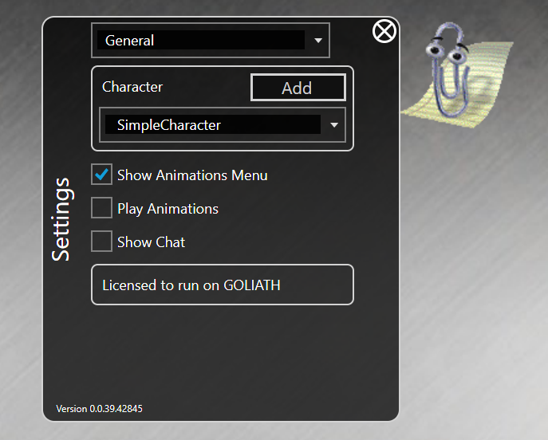

# Characters for nsquared agents

The characters on this page have been built by nsquared and digitally signed so you know you can safely add them to your nsquared agents application.

## Gamey

> [Download Gamey](https://nsquaredorders.blob.core.windows.net/downloads/Gamey.Agent)

## Merlin

> [Download Merlin](https://nsquaredorders.blob.core.windows.net/downloads/Merlin.Agent)

## Clippy

> [Download Clippy](https://nsquaredorders.blob.core.windows.net/downloads/Clippy.Agent)

---

## Adding characters to nsquared agents

1. Run the nsquared agents application and open Settings by right clicking on the character.

1. Click the `Add` button next to the character list

    

1. This will open a file dialog. Find the `.Agent` file you downloaded.

    

1. The new Character will be selected

    
