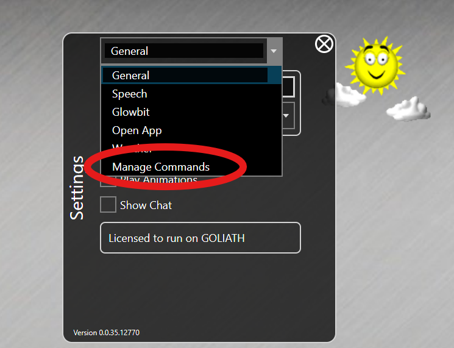
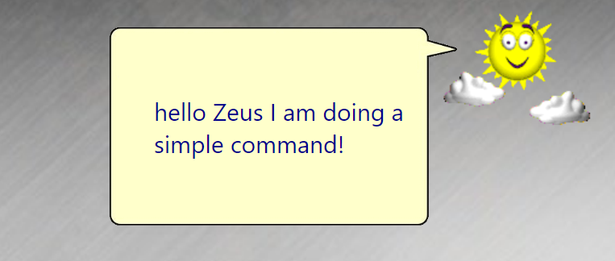

# Building a Command with Settings

This document assumes you have read and understood [Building a Simple Command](Building%20a%20Simple%20Command.md).

Your custom command may need to present options to the customer. This is done by extending the Settings of nsquared agents with a dialog for the command you are building.

The user interface will need to be defined as an [Avalonia UserControl](https://docs.avaloniaui.net/docs/reference/controls/usercontrol).

[The full source code for this example](../../Samples/CommandWithSettings/)

## Step-by-Step creating an nsquared agent Command with Settings

This guide starts with the [Simple Command built in the guide here](Building%20a%20Simple%20Command.md).

1. Add the Avalonia UI package to the project. In terminal, in the same folder as the SimpleCommand.csproj file.

   ```shell
   dotnet add package Avalonia --version 11.2.3
   ```

1. Add the Avalonia.ReactiveUI package to the project. In terminal, in the same folder as the SimpleCommand.csproj file.

   ```shell
   dotnet add package Avalonia.ReactiveUI --version 11.2.3
   ```

1. Create a ViewModel class to hold the settings values. In terminal, in the same folder as the SimpleCommand.csproj file.

   ```shell
   dotnet new class -n SimpleViewModel
   ```

1. Open the `SimpleViewModel.cs` file and edit it to contain a property that can be set.

    ```cs
    using ReactiveUI;

    namespace SimpleCommand;

    public class SimpleViewModel : ReactiveObject
    {
        private static string name = string.Empty;

        public string Name
        {
            get => name;
            set => this.RaiseAndSetIfChanged(ref name, value);
        }
    }
    ```

1. To create the `Avalonia UserControl` you will use the Avalonia Templates. If you do not have them installed locally you can do this from terminal

   ```shell
   dotnet new install Avalonia.Templates
   ```

1. Create a new `SettingsControl` UserControl. In terminal, in the same folder as the SimpleCommand.csproj file.

   ```shell
   dotnet new avalonia.usercontrol -n SettingsControl
   ```

    This will create two files in the project folder `SettingsControl.axaml` and `SettingsControl.axaml.cs`

1. Open the `SettingsControl.axaml` file and edit it to add a `TextBox` bound to the `Name` property on the ViewModel.

   ```xml
   <UserControl xmlns="https://github.com/avaloniaui"
      xmlns:x="http://schemas.microsoft.com/winfx/2006/xaml"
      xmlns:d="http://schemas.microsoft.com/expression/blend/2008"
      xmlns:mc="http://schemas.openxmlformats.org/markup-compatibility/2006"
      mc:Ignorable="d" d:DesignWidth="800" d:DesignHeight="450"
      x:Class="SimpleCommand.SettingsControl">
      <Grid VerticalAlignment="Top" HorizontalAlignment="Left">
         <StackPanel Width="160">
            <Label>Name</Label>
            <TextBox Text="{Binding Name}" />
         </StackPanel>
      </Grid>
   </UserControl>
   ```

1. Open the `SettingsControl.axaml.cs` file and add a constructor that takes the ViewModel as a parameter and sets it to the DataContext.

   ```cs
   public SettingsControl(SimpleViewModel viewModel)
   {
      InitializeComponent();
      DataContext = viewModel;
   }
   ```

1. In the `Command.cs` file add a static field for the ViewModel and use it to return the UserControl in the `SettingsControl` property.

   ```cs
   private static SimpleViewModel ViewModel => new();
   public object SettingsControl => new SettingsControl(ViewModel);
   ```

1. Change the `HasSettings` property to return true.

   ```cs
   public bool HasSettings => true;
   ```

1. Edit the `Perform` method to use the `Name` property of the ViewModel.

   ```cs
   Task<string?> IAgentCommand.Perform(string commandRequest, IAgentAnimations? animations)
    {
        if (commandRequest.Contains("simple", StringComparison.CurrentCultureIgnoreCase))
        {
            return Task.FromResult<string?>($"hello {ViewModel.Name} I am doing a simple command!");
        }
        return Task.FromResult<string?>(null);
    }
   ```

1. Build the Command.

1. Run the nsquared agents application and open Settings, and then go to `Manage Commands`

   

1. If you have an older version of SimpleCommand installed then first remove it and **restart** the nsquared agents app.

   

1. In the Commands select Add

   

1. Find the SimpleCommand.Command file you have built.

   

1. Restart the nsquared agents application to see the SimpleCommand settings option available in Settings screen.

   

1. Select the SimpleCommand and set a name value

   

1. Invoke the SimpleCommand by using the keyword `simple` in your request and you will see the `Name` setting is used by the command.

   

[The full source code for this example](../../Samples/CommandWithSettings/)