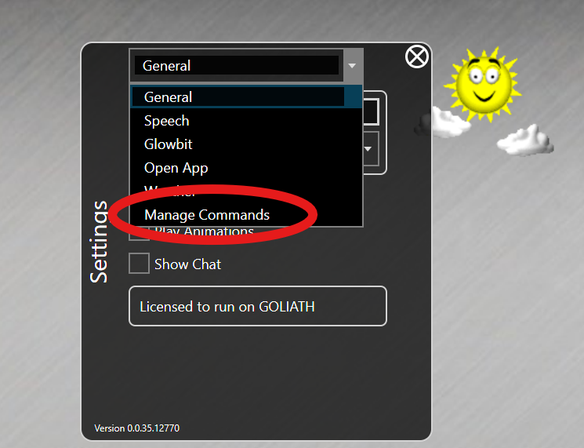
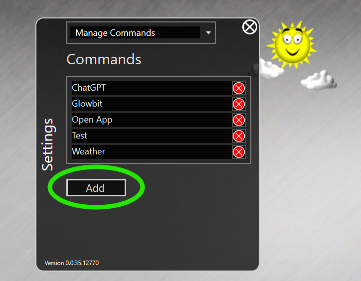
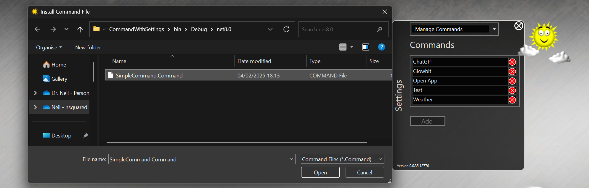
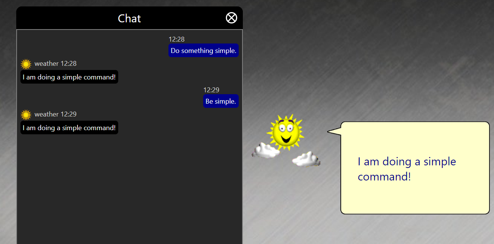

# Building a Simple Command

In order to build a new activity for nsquared agents you will need to build a .NET 8.0 assembly that contains a class that implements the [`IAgentCommand`](IAgentCommand) interface.

> [The full source code for this example](https://github.com/nsquaredsolutions/agents/tree/main/Samples/SimpleCommand)

## Step-by-Step creating a simple nsquared agent Command

1. Start by creating a new C# class library project named SimpleCommand.

   ```bash
    dotnet new classlib --name SimpleCommand
   ```

   This will create a new folder named SimpleCommand containing C# project named SimpleCommand, and a code file named Class1.cs.
1. Rename the file `Class1.cs` to `Command.cs`
1. Rename the class in the code to `Command`

   ```cs
    namespace SimpleCommand;
    public class Command
    {
    }
   ```

1. In the `SimpleCommand.csproj` file make sure the `TargetFramework` is `net8.0`

   ```xml
    <TargetFramework>net8.0</TargetFramework>
   ```

1. In the `SimpleCommand.csproj` file add a `TargetExt` field below the `TargetFramework` line

   ```xml
    <TargetExt>.Command</TargetExt>
   ```

1. Add a package reference to the nsquared.agents NuGet package, from PowerShell you can do this with the following command.

   ```sh
   dotnet add package nsquared.agents.api --prerelease

   ```

   This will add the reference to the `SimpleCommand.csproj` file

   ```xml
    <ItemGroup>
      <PackageReference Include="naquared.agents.api" />
    </ItemGroup>
   ```

1. In the `Command.cs` file add a `using` to import the `nsquared.agents` namespace

   ```cs
    using nsquared.agents;
   ```

1. In the `Command.cs` file implement the `IAgentCommand` interface in the Command class

   ```cs
    public class Command : IAgentCommand
   ```

1. Add the required methods to the `Command` class

   ```cs
    using nsquared.agents;

    namespace SimpleCommand;
    public class Command : IAgentCommand
    {
        public string Name => "SimpleCommand";

        public bool HasSettings => false;
        public AgentCommandType CommandType => AgentCommandType.KeywordLocal;

        Task<string?> IAgentCommand.Perform(string commandRequest, IAgentAnimations? animations)
        {
            if (commandRequest.Contains("simple", StringComparison.CurrentCultureIgnoreCase))
            {
                return Task.FromResult<string?>("I am doing a simple command!");
            }
            return Task.FromResult<string?>(null);
        }
    }
   ```

1. Build the SimpleCommand project. It should build the `SimpleCommand.Command` file in a bin folder.

1. Run the nsquared agents application and open Settings, and then go to `Manage Commands`

   

1. In the Commands select Add

   

1. Find the SimpleCommand.Command file you have built.

   

1. Invoke the SimpleCommand by using the keyword `simple` in your request 



> [The full source code for this example](https://github.com/nsquaredsolutions/agents/tree/main/Samples/SimpleCommand)

> [Building a Command with Settings](./Building%20a%20Command%20with%20Settings)