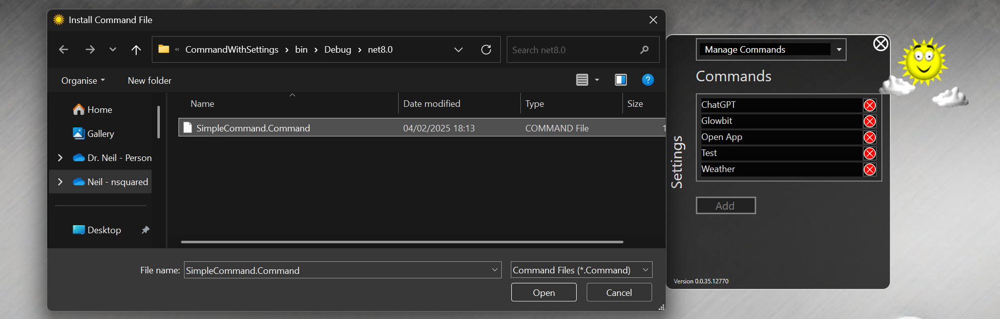

# Commands for nsquared agents

The commands on this page have been built by nsquared and digitally signed so you know you can safely add them to your nsquared agents application.

## OpenApp

> [Download OpenApp](https://nsquaredorders.blob.core.windows.net/downloads/OpenApp.Command)

Trigger applications and commands to run on your machine.

Customizable so you can setup your own commands to open different applications with arguments.

---

## Adding commands to nsquared agents

1. Run the nsquared agents application and open Settings, and then go to `Manage Commands`

   

1. In the Commands select Add

   

1. Find the .Command file you have downloaded.

   