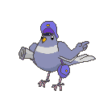

# nsquared agents

## Introduction

nsquared agents provides animated characters for your desktop. The nsquared agents application comes with a selection of predefined characters and commands.

The free version allows you to select from characters and see the random animations.

For the characters to perform commands you will need to register, and license, the nsquared agents application.

[Download from the nsquared agents product page](https://nsquared.com.au/products/agents)

## Adding new characters

Character files can be added. You can download character (.agent) files and add them from the General Settings.
  <!-- <insert image of Add character in settings -->
> Information on creating your own characters `coming soon`<!-- <insert link here> -->

## Adding new commands

Additional commands can be installed on the licensed version of nsquared agents.

> [Instructions on building your own Command.](./Docs/Commands/Building%20a%20Simple%20Command.md)