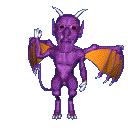

# nsquared agents

## Introduction

nsquared agents provides animated characters for your desktop. The nsquared agents application comes with a selection of predefined characters and commands.

The free version allows you to select from characters and see their animations.

For the characters to perform commands you will need to register, and license, the nsquared agents application.

> [Download from the nsquared agents product page](https://nsquared.com.au/products/agents)

---

## Adding new characters

Character files can be added. You can download character (.agent) files and add them from the General Settings.

> [Characters available to download](./Docs/Characters/Index)

> [Information on creating your own characters](./Docs/Characters/Creating%20a%20Simple%20Character)

---

## Adding new commands

Additional commands can be installed on the licensed version of nsquared agents.

> [Commands available to download](./Docs/Commands/Index)

> [Instructions how to building your own Command.](./Docs/Commands/Building%20a%20Simple%20Command)

